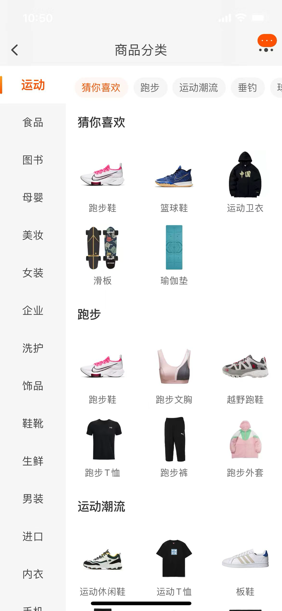

# 仿淘宝商品分类页面项目

这是一个使用ReactJS和Express.js开发的商品分类页面应用。本项目实现了一个交互式的商品浏览界面，用户可以通过点击左侧的分类列表来查看不同分类下的商品，同时还能通过顶部的筛选条来筛选商品。

## 模仿页面



## 项目网站


## 功能特性

1. **分类数据展示**：页面加载时自动展示左侧的商品分类和首个分类的商品内容。
2. **动态内容更新**：
   - 点击左侧分类，右侧展示该分类下的商品，且点击的分类名称会自动居中。
   - 点击右侧顶部筛选项，根据筛选条件刷新商品显示，并使选中的筛选项自动居中。
3. **滚动联动效果**：在商品内容区滚动时，顶部筛选项会根据显示的商品自动切换并居中。
4. **后端模拟**：使用Express.js和JSON文件模拟数据接口，实现前后端分离的开发模式。

## 技术栈

- **前端**：ReactJS, HTML, CSS/SCSS
- **后端**：Express.js
- **数据接口**：REST API

## 目录结构

```
/project-root
|-- public/                 # 公共静态资源
|-- src/                    # 源代码目录
    |-- apis/               # API调用相关
    |-- pages/              # 页面组件
        |-- MainContent     # 主内容组件
            |-- index.js    # 主内容组件入口
        |-- Sidebar         # 侧边栏组件
            |-- index.js    # 侧边栏组件入口
        |-- index.js        # 页面入口
        |-- index.scss      # 页面样式
    |-- App.js              # 应用入口
    |-- index.js            # React渲染入口
|-- server/                 # 服务器端代码
|-- package.json            # 项目依赖
|-- package-lock.json       # 项目依赖锁定文件
|-- README.md               # 项目说明文件
```

## 运行项目

1. **安装依赖**：

   ```bash
   npm install
   ```

2. **启动前端和后端服务器**：

   ```bash
   node run server
   ```

3. **启动前端应用**：

   ```bash
   npm start
   ```

   访问 `http://localhost:3000` 来查看应用。

## API 接口

### 获取一级分类列表

- **方法**：GET
- **URL**：`/categories`
- **响应**：

  ```json
  [
    {
      "id": 1,
      "name": "电子产品"
    },
    {
      "id": 2,
      "name": "家用电器"
    }
  ]
  ```

### 获取指定一级分类下的具体内容

- **方法**：GET
- **URL**：`/categories/:id`
- **示例**：`http://localhost:3004/categories/1`
- **响应**：

  ```json
  {
    "id": 1,
    "name": "电子产品",
    "subcategories": [
      {
        "id": 101,
        "name": "手机",
        "products": [
          {"id": 1001, "name": "iPhone 12", "image": "images/image.webp", "subcategoryId": 1},
          {"id": 1002, "name": "Samsung Galaxy S20", "image": "images/image.webp", "subcategoryId": 1}
        ]
      },
      {
        "id": 102,
        "name": "电脑",
        "products": [
          {"id": 1003, "name": "MacBook Pro", "image": "images/image.webp", "subcategoryId": 2},
          {"id": 1004, "name": "Dell XPS 13", "image": "images/image.webp", "subcategoryId": 2}
        ]
      }
    ]
  }
  ```

## 开源许可

本项目采用MIT许可证，详情请参见[LICENSE](LICENSE)文件。